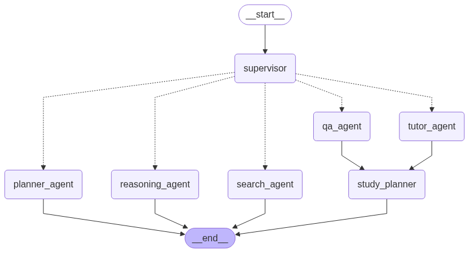

# Nexa: The Agentic RAG LMS

Nexa is an advanced, AI-powered Learning Management System (LMS) built on a modern full-stack architecture.  
It leverages a sophisticated multi-agent RAG (Retrieval-Augmented Generation) system to deliver a dynamic, personalized, and intelligent learning experience.

---

## Overview

At the heart of Nexa is a Supervisor Agent that intelligently analyzes user queries and routes them to specialized agents:

- **QA Agent** – Direct, factual answers from uploaded textbooks.
- **Tutor Agent** – Simplifies complex topics for better understanding.
- **Planner Agent** – Creates structured study plans and outlines.
- **Reasoning Agent** – Handles logic puzzles and multi-step reasoning tasks.

**Tech Stack:**
- **Backend:** FastAPI, LangGraph, Qdrant (Vector Store)
- **Frontend:** React (clean, responsive UI)
- **LLM Provider:** Groq API

---

## Features

- Multi-Agent Architecture – Intelligent routing of queries to specialized agents.
- RAG-Powered QA – Retrieval-Augmented Generation for accurate, context-aware answers.
- Document Upload – Upload textbooks or study material for ingestion.
- Interactive Tutoring – Natural explanations and guided learning.
- Study Plan Generation – Personalized outlines for efficient learning.
- Logic & Reasoning Support – Solve step-by-step problems and puzzles.
- Responsive Web UI – Seamless experience across devices.

---

## System Architecture

The LangGraph workflow powers dynamic agent orchestration.

> Create a folder named `assets` in your LMS root directory and place `lms_agent_workflow.png` inside it for the diagram to display.

---

